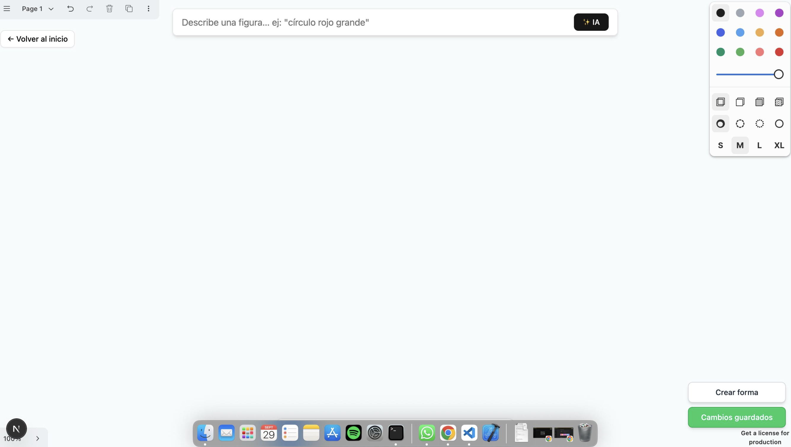

# Drawing Editor — Next.js · tldraw · tRPC

Sistema de dibujo que integra **tldraw** sobre **Next.js (App Router)** con **persistencia tipada end-to-end (tRPC)**, **autosave con debounce**, **UI con Tailwind + shadcn/ui**

---

## 1) Descripción general

El objetivo es demostrar un editor funcional con:

- **Canvas** tldraw y manipulación programática de shapes.
- **Persistencia** del documento vía tRPC (`document.get` / `document.save`) usando **SuperJSON**.
- **Autosave** tras cualquier cambio del store (con debounce).
- **Toasts** y badges de estado (UX clara de carga/guardado).

---

## 2) Inicio rápido

### Requisitos

- Node.js **18+**
- NPM o PNPM

### Instalación

```bash
git clone https://github.com/DiegoEstela/tldraw-editor.git
cd tldraw-editor
npm install
```

---

## 2) Qué vas a ver

- **Landing / Home**: **“Comenzar el challenge”**.
- **Editor**:
  - Lienzo tldraw.
  - **Autosave** tras cada cambio del store (debounce configurable).
  - **Acción “Crear/Modificar forma”** (crea si no existe; luego cicla tipos).
  - **Estado de guardado**: “Guardando…” / “Cambios guardados”.

---

## 3) Stack técnico

- **Next.js (App Router) + TypeScript**
- **tldraw** (canvas, API de shapes y snapshots)
- **tRPC** (router server + cliente; tipos end-to-end)
- **SuperJSON** (serialización segura de snapshots complejos)
- **TailwindCSS + shadcn/ui + CVA** (UI consistente, escalable y tipada)

---

## 4) Estructura del proyecto

```
src/
 ├─ app/
 │   ├─ api/trpc/[trpc]/route.ts      # Handler de tRPC (App Router)
 │   ├─ editor/page.tsx               # EditorPage (vista; sin lógica de negocio)
 │   ├─ layout.tsx                    # Providers globales (Toasts, React Query)
 │   └─ page.tsx                      # Landing (Welcome)
 ├─ components/ui/
 │   ├─ button/                       # Button (shadcn + CVA)
 │   ├─ toast/                        # ToastProvider, Toaster, variants
 │   └─ welcome/                      # UI de la landing (variants)
 ├─ features/editor/
 │   └─ hooks/useEditorPersistence.ts # Hook headless: carga, autosave, acciones
 ├─ lib/
 │   ├─ constants.ts                  # Constantes y tipos compartidos
 │   └─ utils.ts                      # Helpers (cn, etc.)
 └─ server/trpc/
     ├─ core.ts                       # initTRPC + transformer (SuperJSON)
     └─ routers/
         ├─ _app.ts                   # appRouter (composición de routers)
         └─ document.ts               # document.get / document.save (mock en memoria)
```

### Razonamiento de la estructura

- **Feature-oriented**: la lógica del editor vive en `features/editor`.
- **Headless Hook + Presentational Component**: `useEditorPersistence` concentra efectos/llamadas; las páginas **solo renderizan**.
- **UI desacoplada** en `components/ui` con **CVA** por componente → escalable sin duplicar clases.
- **Routers tRPC** aislados bajo `server/trpc` → tipado end-to-end y claridad de capa servidor.

---

## 5) Decisiones

### 5.1 Hook `useEditorPersistence`

- **Responsabilidad**
  - Cargar snapshot (`document.get`) al montar el editor.
  - Suscribirse a `editor.store` y guardar (`document.save`) con **debounce**.
  - Exponer `handleEditorMount` y `handleModifyShape` (demo programática).
  - Emitir toasts en fallos de carga/guardado.
- **Motivación**
  - Aislar efectos y side-effects en un hook **headless**, manteniendo vistas declarativas, limpias y testeables.

### 5.2 Persistencia (`documentRouter`)

- **Mock en memoria** apropiado para el challenge.
- **SuperJSON** para serializar snapshots complejos sin perder tipos.

### 5.3 UX/UI

- **Top bar** flotante minimal: botón “Volver al inicio” (izq.) + panel IA (centrado).
- **Acciones** en **bottom-right**: “Crear/Modificar forma” + badge de estado.
- **Toasts** custom (Provider + Toaster + variants) → control total del feedback.
- **Modo Oscuro** persistente (localStorage + `prefers-color-scheme`).

---

## 6) Cumplimiento del challenge

**Functional Requirements**

- Editor page (tldraw)
- API para recuperar store (`document.get`)
- Guardado tras cambios con debounce (`document.save`)
- Botón “crear/modificar forma”
- Next.js API routes (App Router + tRPC)
- Tailwind + shadcn/ui para la UI
- tRPC type-safe entre cliente y servidor

**Technical Requirements**

- Next.js desde cero
- Tailwind + shadcn integrados
- tRPC con endpoints `get` y `save`
- App routing (landing → editor)
- Manejo de errores y estados (toasts / overlay)
- README con setup/run/tests de API

---

## 7) Futuro: IA (plan de implementación)

> **La app actual NO utiliza IA.**  
> La idea es sumar un panel de texto para “pedir” figuras por prompt (p. ej., “círculo rojo 200”). Se propone:



**Arquitectura**

- **Endpoint tRPC** `ai.generateShape` (server-only) que:
  1. Llama a OpenAI (Chat Completions) con `response_format: json_object`.
  2. **Normaliza** la respuesta (mapea `circle→ellipse`, `square→rectangle`, `gray→grey`).
  3. **Valida** con Zod (`geo/color/anchos/altos`).
  4. Devuelve `{ ok:true, shape }` o `{ ok:false, error }`.

**UX**

- Input + botón “✨ Generar”.
- Si `{ ok:false }` → **toast** con el motivo (no se crea nada).
- Si `{ ok:true }` → se inserta la shape en el canvas.

**Seguridad y costes**

- Clave `OPENAI_API_KEY` en **variables de entorno** (Vercel/Local).
- Validación estricta + **clamp de tamaños**.

**Implementación resumida**

- Server: `fetch` a `https://api.openai.com/v1/chat/completions` (sin SDK para evitar conflictos), normalización y Zod.
- Cliente: reuso de tRPC + creación de la shape en `editor.createShapes()`.

---
